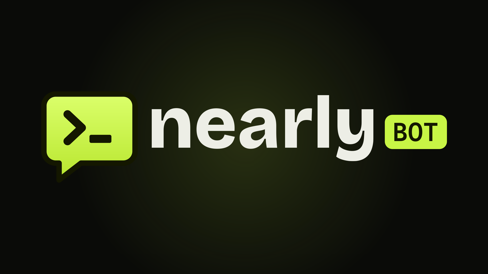

<p align="center">
  
</p>

<p align="center"><b>Launch a token with one message.</b></p>

<p align="center">
  <a href="https://nearlybot.com">Website</a> ·
  <a href="https://t.me/nearlytradebot">Telegram bot</a> ·
  <a href="https://x.com/nearlytradesbot">X bot</a> ·
  <a href="https://t.me/nearlybotlaunches">Launches channel</a> ·
  <a href="https://x.com/nearlytradebot">X</a>
</p>

---

**Nearly Bot** launches tokens on [NEAR](https://near.org) from a chat message: in the Telegram bot, or with a
post on X. Every launch goes through the [nearly.trade](https://nearly.trade) factory, `nearlytrade.near`: a
fixed 1,000,000,000-supply NEP-141 token whose whole supply opens in its own Rhea pool from the first block.
Creators earn **0.64% of every trade**.

The website is where you **swap**, **bridge** and follow launches. It doesn't launch tokens.

## Launch in one message

**Telegram**: open [@nearlytradebot](https://t.me/nearlytradebot), send `/start`, then `/launch` and answer
five questions (name, ticker, logo, description, first buy). The bot shows the exact cost before you confirm.

**X**: fund your X wallet (post `@nearlytradesbot wallet`), then post:

```
@nearlytradesbot launch Moon Cat $MCAT
```

Attach a photo for the logo. Add options after the ticker, in any order:

```
@nearlytradesbot launch Moon Cat $MCAT desc "The cat that went to the moon" site https://mooncat.xyz first buy 1 tax 2/2 split 50/50/0
```

Full guides: [Telegram](docs/launch-on-telegram.md) · [X](docs/launch-on-x.md)

## What you can do

| Where | What |
| --- | --- |
| Telegram bot | Launch, buy, sell, bridge, several wallets, custom wallet names, invite friends and earn |
| X | Launch, get a wallet, custom name, bridge in and out, all from posts |
| Website | Swap Nearly Bot tokens, bridge about 200 assets across 30+ chains, board, stats, docs |
| Launches channel | Every Nearly Bot launch, from Telegram and X |

## Repository contents

| Path | What's in it |
| --- | --- |
| [`brand/`](brand/) | Logo (SVG and 4K PNG), profile pictures, banners and brand guidelines |
| [`docs/how-it-works.md`](docs/how-it-works.md) | From message to live token, step by step |
| [`docs/launch-on-telegram.md`](docs/launch-on-telegram.md) | The Telegram bot: launching, trading, wallets, commands |
| [`docs/launch-on-x.md`](docs/launch-on-x.md) | Launching from a post on X, with every option |
| [`docs/fees.md`](docs/fees.md) | Every fee and where it goes |
| [`docs/referrals.md`](docs/referrals.md) | Invite & earn on Telegram |
| [`docs/bridge.md`](docs/bridge.md) | Bridging in and out through NEAR Intents |
| [`docs/wallets-and-security.md`](docs/wallets-and-security.md) | How bot wallets and keys are handled |
| [`docs/accounts.md`](docs/accounts.md) | On-chain accounts and how to verify a launch |
| [`docs/faq.md`](docs/faq.md) | Common questions |

## On-chain accounts (NEAR mainnet)

| Role | Account |
| --- | --- |
| Launch factory (nearly.trade) | [`nearlytrade.near`](https://nearblocks.io/address/nearlytrade.near) |
| Pools (Rhea DCL) | [`dclv2.ref-labs.near`](https://nearblocks.io/address/dclv2.ref-labs.near) |
| Wrapped NEAR | [`wrap.near`](https://nearblocks.io/address/wrap.near) |
| Nearly Bot fees and custom wallet names | [`nearlytradebot.near`](https://nearblocks.io/address/nearlytradebot.near) |
| Tokens | `<ticker>.nearlytrade.near` |

Nearly Bot deploys no contract of its own: every token is created by the nearly.trade factory. See
[how to verify a launch](docs/accounts.md#verify-a-launch).

## Fees

| What | Amount |
| --- | --- |
| Launch | **0.05 NEAR** Nearly Bot fee, plus about 0.16 NEAR of on-chain storage and gas. On Telegram launches by someone you invited, 0.01 NEAR of the fee goes to you |
| Custom wallet name | **0.02 NEAR**, once |
| Swap (buy or sell) | **0.5%** of the NEAR side, on the website and in the Telegram bot |
| Bridge | **0.5%**, included in the quote |
| Trading | The pool's 1% fee per trade, of which **0.64% goes to the token's creator** |

All fees Nearly Bot collects (after referral rewards) go to **buybacks, burns and platform development**.
Details: [docs/fees.md](docs/fees.md).

## Risk notice

Tokens launched through Nearly Bot are created by users, not by Nearly Bot. They're highly speculative and
can lose all their value. Nothing here is financial advice. Nearly Bot relies on third-party contracts
(nearly.trade, Rhea, NEAR Intents) that it doesn't control, and has not had a professional security audit.
Bot wallets are custodial: keep only what you're actively using in them. Use Nearly Bot at your own risk.

## License

Source-available, not open source. You may read, share and link to this repository and use the brand assets
to refer to Nearly Bot; you may not use them for a competing launchpad or bot. See [LICENSE](LICENSE).
